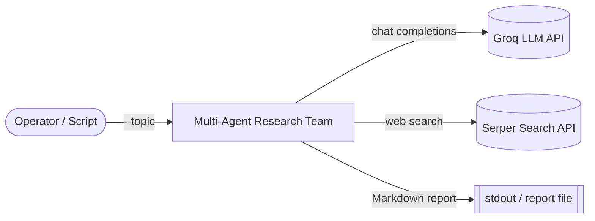
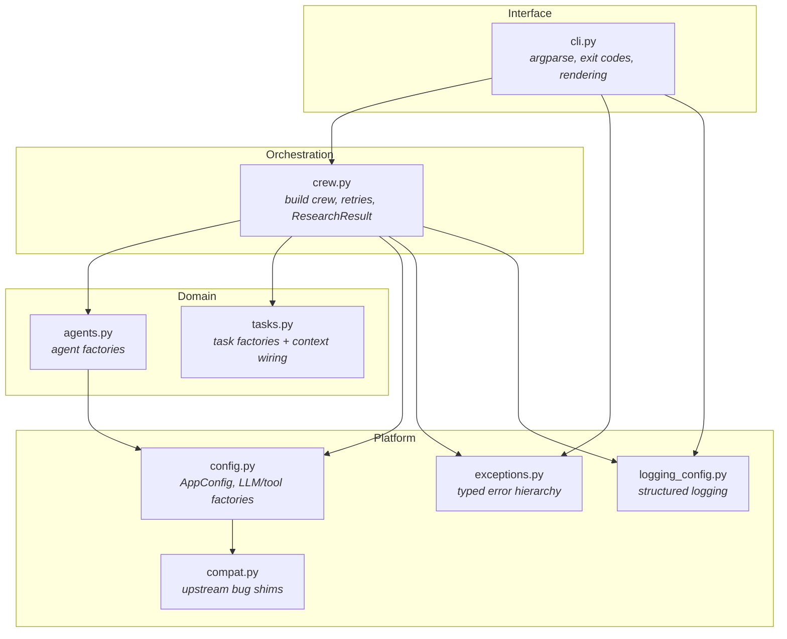
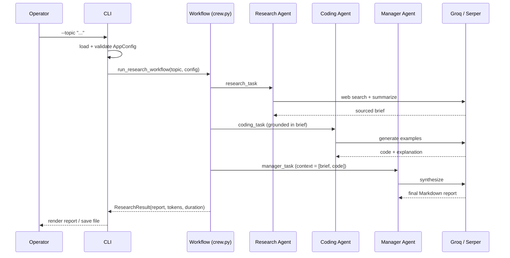
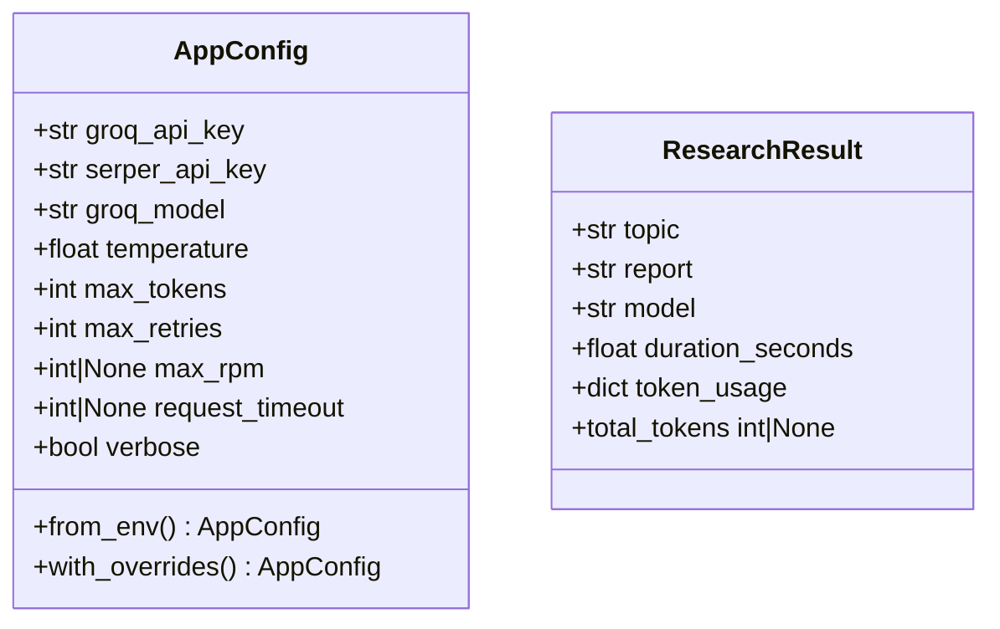
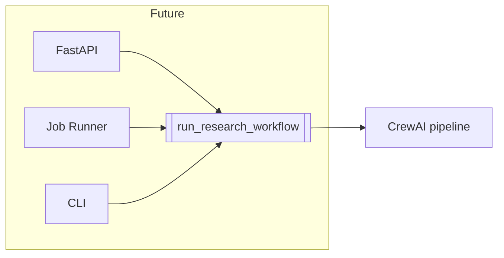

# Architecture (High-Level Design)

This document describes the high-level design (HLD) of the Multi-Agent Research
Team: its components, data flow, key design decisions, and the extension points
that let it grow from a CLI into a larger service.

## 1. System context

The application is a standalone CLI that orchestrates a team of LLM agents. It
depends on two external services and is driven by a human operator or an
automation script.

Design intent: the system is a thin, deterministic orchestration layer over
CrewAI. All heavy lifting (reasoning, tool calls) is delegated to the agent
framework and the model provider. The application owns configuration,
resilience, observability, and the user-facing contract.

## 2. Component view

The package is organized into small, single-responsibility modules with a
strict dependency direction (CLI to orchestration to agents/tasks to config).
Nothing lower ever imports something higher.

| Module | Responsibility |
| --- | --- |
| `cli.py` | Parse arguments, configure logging, resolve config and overrides, render output, map exceptions to exit codes. |
| `crew.py` | Assemble the sequential crew, run it with retries and backoff, return a structured `ResearchResult`. |
| `agents.py` | Build the three specialist agents from configuration. |
| `tasks.py` | Describe each task and wire the manager task's context dependencies. |
| `config.py` | Immutable, validated `AppConfig`; lazy factories for the LLM and search tool. |
| `exceptions.py` | Typed error hierarchy so callers can react to why a run failed. |
| `logging_config.py` | One place to configure package logging (a Rich handler for the CLI). |
| `compat.py` | Guarded, idempotent workarounds for known third-party bugs. |

## 3. Runtime flow

A single run is a deterministic, sequential pipeline. Each agent's output feeds
the next, and the manager synthesizes the final report from explicit context.

Determinism: delegation is disabled on every agent and the process is
`Process.sequential`. Agents communicate only through declared task context,
which keeps runs reproducible and easy to debug. This is a deliberate trade of
autonomy for predictability.

## 4. Key data structures

- `AppConfig` is frozen and validated at construction, so misconfiguration fails
  fast with a clear `ConfigError` before any API call is made.
- `ResearchResult` is a structured return value rather than a bare string, so
  the workflow is equally usable from an HTTP handler or a job runner.

## 5. Cross-cutting concerns

### Resilience

Model providers routinely return transient errors (rate limits, timeouts, 5xx).
`_run_with_retries` retries these with exponential backoff and translates
terminal failures into typed exceptions (`RateLimitExceededError`,
`WorkflowError`). The set of retryable error types is resolved defensively from
LiteLLM so the application tolerates version drift.

### Error taxonomy and exit codes

| Exception | Exit code | Meaning |
| --- | --- | --- |
| (none) | `0` | Success |
| `WorkflowError` / `RateLimitExceededError` | `1` | Run failed |
| `ConfigError` | `2` | Missing or invalid configuration |
| `DependencyError` | `3` | A required dependency is not installed |
| `KeyboardInterrupt` | `130` | Interrupted |

### Observability

All logging flows through the `research_team` logger namespace, so a host
process can attach its own handlers or route to a structured sink. The CLI
installs a Rich handler; `--verbose`, `--quiet`, and `--log-level` control
verbosity.

### Performance and startup

Heavy dependencies (CrewAI, LiteLLM) are imported lazily inside factories, so
`--help` and `--version` and the unit tests run without loading the full agent
stack. A single LLM and search tool are shared across the agents.

### Privacy

CrewAI telemetry and interactive tracing are disabled by default
(`CREWAI_DISABLE_TELEMETRY`, `CREWAI_TRACING_ENABLED`). Operators can opt back
in through environment variables.

## 6. Extensibility

The layering is chosen so the system can evolve without rewrites:

- **Add an agent or task.** Add a factory in `agents.py` or `tasks.py` and wire
  it into `build_crew`. Nothing else changes.
- **Swap the model provider.** `config.build_llm` is the only place that binds
  Groq; point it at another LiteLLM-supported provider.
- **Expose an API.** `run_research_workflow(topic, config)` returns a
  `ResearchResult` and is transport-agnostic. Wrap it in FastAPI, a queue
  consumer, or a scheduler without touching the domain layer.
- **Persist or cache.** Results are structured; add a repository around the
  workflow boundary.

## 7. Known constraints

- **Free-tier token limits.** Groq's free tier enforces a per-minute token
  budget. The three-agent workflow accumulates context, so very large topics
  may be rate-limited. The application retries with backoff and surfaces a clear
  message. Use a higher-tier key, a lighter model, or a lower `GROQ_MAX_TOKENS`
  for heavy workloads.
- **Sequential by design.** Throughput is bounded by sequential execution. This
  is intentional for determinism; a parallel or hierarchical process is a
  possible future mode.
